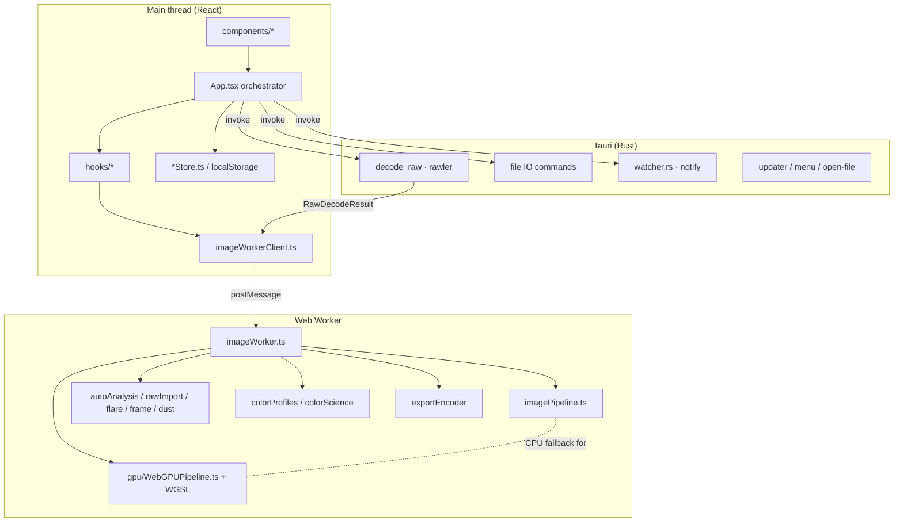
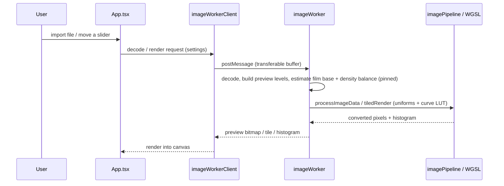

# DarkSlide — Architecture Review

> Analysis-only document. No production code was modified. All file/line references are to the state of the repository at the time of the audit.

## 1. System overview

DarkSlide is a **dual-target** film-negative-to-positive converter:

- **Web app** — pure browser build (`vite build` → `dist/`, deployed to `darkslide.vercel.app`). All imaging runs client-side.
- **Desktop app** — the same frontend wrapped in **Tauri 2** (Rust), which adds RAW decoding, a scanning-session folder watcher, native file dialogs/menus, "open in external editor," and an auto-updater.

There is no server-side processing and no cloud upload; everything is local.

### Tech stack (from `package.json`, `src-tauri/Cargo.toml`, README)

| Layer | Technology |
|---|---|
| UI | React 19, Vite 6, Tailwind CSS v4, TypeScript ~5.8, Framer Motion (`motion`), Lucide icons |
| Imaging | Web Worker (`imageWorker.ts`), WebGPU (WGSL shaders) with CPU fallback, UTIF (TIFF), piexifjs (EXIF) |
| Desktop | Tauri 2.10 (Rust 2021, edition rust-version 1.77.2), `rawler` 0.7 (RAW), `notify` 7 (watcher), `tauri-plugin-{dialog,fs,notification,updater}` |
| Test | Vitest 4 + Testing Library (frontend), `#[cfg(test)]` (Rust) |

## 2. Folder structure

```
DarkSlide_Test/
├─ src/                         # React + TS frontend
│  ├─ App.tsx                   # ~2960 lines — root orchestrator (god component)
│  ├─ ScanningSessionWindow.tsx # secondary window UI
│  ├─ components/               # ~30 presentational + modal components
│  ├─ hooks/                    # ~20 hooks (tabs, history, shortcuts, import, rolls, zoom…)
│  ├─ utils/                    # imaging + persistence core (the heart of the app)
│  │  ├─ imagePipeline.ts       # per-pixel conversion math (CPU)
│  │  ├─ imageWorker.ts         # Web Worker: owns document state, tiling, analysis
│  │  ├─ imageWorkerClient.ts   # main-thread proxy to the worker
│  │  ├─ colorProfiles.ts       # ICC parse/generate, profile transforms
│  │  ├─ colorScience.ts        # sRGB/Lab/XYZ, deltaE
│  │  ├─ autoAnalysis.ts        # auto exposure/WB/contrast/mono detection
│  │  ├─ rawImport.ts           # film-base estimation, RAW→worker request
│  │  ├─ flareEstimation.ts     # per-channel flare floor
│  │  ├─ dustDetection.ts / dustRemoval.ts / dustGeometry.ts
│  │  ├─ frameDetection.ts      # auto crop / frame edge detection
│  │  ├─ exportEncoder.ts       # PNG/TIFF/JPEG/WebP encoders
│  │  ├─ iccEmbed.ts, srgbIccProfile.ts, binaryEncoding.ts
│  │  ├─ gpu/WebGPUPipeline.ts + shaders/*.wgsl
│  │  └─ *Store.ts              # preference/preset/recent/quickExport/resident persistence
│  ├─ constants.ts              # ~1460 lines — film profiles, presets, thresholds
│  └─ types.ts                  # ~880 lines — the domain model
├─ src-tauri/                   # Rust desktop backend
│  └─ src/{main.rs, lib.rs, watcher.rs}
└─ src/test/fixtures/reference/ # per-stock reference JSON (regression fixtures)
```

## 3. Module responsibilities & relationships



- **`App.tsx`** wires tabs, panes, keyboard shortcuts, import/export, and settings state, and dispatches all imaging work through `imageWorkerClient`.
- **`imageWorkerClient.ts`** is a typed request/response bridge (see `workerProtocol.ts`) over `postMessage`, with transferable `ArrayBuffer`s to avoid copies.
- **`imageWorker.ts`** is the stateful engine: it owns `StoredDocument`s, builds multi-resolution preview levels (`buildPreviewLevels`), runs tile jobs (`handlePrepareTileJob`/`handleReadTile`), caches per-document analysis (residual base, highlight density), and pins deterministic conversion parameters.
- **Rust** exposes narrow `#[tauri::command]`s (`decode_raw`, `save_blob_to_directory`, `read_file_by_path`, `start_watching`, updater) — a clean, minimal FFI surface.

## 4. Image-processing invocation flow (UI → pixels)



## 5. Build system & configuration

- **Vite** (`vite.config.ts`) with React and Tailwind plugins; separate `tsconfig.worker.json` for the worker/WGSL types (`typecheck` runs both).
- **WGSL** imported as modules (`wgsl.d.ts`, `webgpu.d.ts`).
- **Tauri** config in `src-tauri/tauri.conf.json`; capabilities split into `default.json` and `scanning.json` (least-privilege per window).
- **CI**: `.github/workflows/build.yml`; release notes in `.github/release-notes/`.
- **Updater** is fully wired but gated behind build-time env vars (`DARKSLIDE_ENABLE_UPDATER`, `DARKSLIDE_UPDATER_PUBKEY`, endpoints) — see `lib.rs:65-95`.

## 6. State management

- **In-session UI state**: React `useState`/hooks. Tabs via `useDocumentTabs`, rolls via `useRolls`, zoom via `useViewportZoom`.
- **Undo/redo**: `useHistory.ts` — a JSON-snapshot stack capped at `HISTORY_LIMIT = 50`, with `beginInteraction`/`commitInteraction` to coalesce slider drags into a single step.
- **Persistence**: hand-rolled `*Store.ts` modules over `localStorage` (preferences, custom presets, recent files, quick-export presets, custom light sources). Presets export/import as `.darkslide` JSON files.
- **Worker-side state**: `StoredDocument` map with preview levels, tile jobs, and analysis caches; memory is bounded by `estimateMemoryBytes` + `handleEvictPreviews`.

## 7. Error handling & logging

- `diagnostics.ts` collects a rolling diagnostic log; worker failures, import errors, and export failures surface as toasts with a copyable diagnostic ID (`toastStore.ts`, README v0.9.0).
- `ErrorBoundary.tsx` guards the React tree.
- Color-transform failures throw a typed `ColorProfileConversionError` (`colorProfiles.ts:861`) so exports fail loudly rather than emitting mis-tagged pixels.
- Rust commands return `Result<_, String>`; the macOS `RunEvent::Opened` handler wraps work in `catch_unwind` to avoid aborting across the FFI boundary (`lib.rs:751-765`).

## 8. Packaging & platform compatibility

- **macOS**: universal binary, `.dmg`; not notarized (README documents the Gatekeeper workaround). Native menus and `application:openURLs:` handling are macOS-specific.
- **Windows / Linux**: experimental, unsigned (README). "Open in external editor" is macOS-only (`lib.rs:455-459` returns an error elsewhere).
- **Browser**: full app minus RAW, scanning sessions, and native OS integration.

## 9. Ratings (see `technical_debt.md` for justification)

| Category | Score /10 |
|---|---|
| Maintainability | 6 |
| Readability | 7 |
| Modularity | 6 |
| Coupling | 5 |
| Cohesion | 6 |
| Scalability | 6 |
| Extensibility | 5 |
| Code duplication | 4 |
| Performance | 6 |
| Memory efficiency | 6 |
| Thread safety | 8 |
| GPU readiness | 7 |
| Cross-platform | 6 |

**Headline:** the domain layer (imaging, color, film-base estimation) is genuinely sophisticated and well tested, but three files (`App.tsx`, `imageWorker.ts`, `imageWorkerClient.ts`) concentrate most of the complexity, and the pipeline is duplicated across CPU/float/GPU implementations that must be kept in manual parity.
