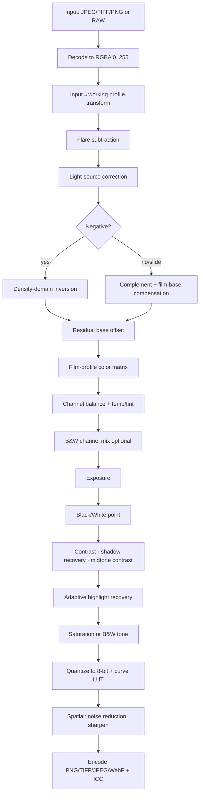

# DarkSlide — Image-Processing Pipeline

> Traced from input file to exported image. Primary source: `src/utils/imagePipeline.ts`, `colorProfiles.ts`, `rawImport.ts`, `autoAnalysis.ts`, `flareEstimation.ts`, `exportEncoder.ts`, `imageWorker.ts`, `src-tauri/src/lib.rs`, and `gpu/shaders/tiledRender.wgsl`.

## 0. Pipeline at a glance



The per-pixel sequence is implemented three times in parity: CPU 8-bit (`processImageData`, `imagePipeline.ts:1211`), CPU float (`processFloatRaster`, `imagePipeline.ts:1411`), and GPU (`tiledRender.wgsl`). Uniform packing for the GPU lives in `buildProcessingUniforms` (`imagePipeline.ts:917`).

---

## 1. Input loading

### RAW (`src-tauri/src/lib.rs:97` `decode_raw`)
- `rawler::decode_file` → `RawDevelop` with steps **Rescale, Demosaic, CropActiveArea, Calibrate, CropDefault, SRgb** → `to_rgb16()`.
- **Camera white balance is intentionally omitted** (comment `lib.rs:101-104`) because scene WB skews an orange negative.
- Output: 16-bit sRGB-encoded RGB + EXIF orientation. Formats: DNG, CR3, NEF, ARW, RAF, RW2 (`RAW_EXTENSIONS`).
- **Weakness:** the negative is developed to a **display-encoded, camera-calibrated sRGB** buffer. Inversion therefore happens on gamma-encoded, matrix-baked data rather than linear scene-referred RAW — the single largest color-fidelity gap vs NLP (see `nlp_comparison.md`).

### TIFF (`utils/tiff.ts`, UTIF) and raster (`decodeRasterBlob`, `imageWorker.ts:219`)
- TIFF via UTIF; JPEG/PNG/WebP via `createImageBitmap`/OffscreenCanvas. EXIF via piexifjs.

### Bit-depth handling
- 16-bit RAW is preserved as a `highDepthRawBuffer` only up to `MAX_HIGH_DEPTH_RAW_PIXELS` (`rawImport.ts:76-86`), and used for film-base estimation (`estimateFilmBase16`). **The render/preview path down-converts to 8-bit RGBA** (`rgb16ToRgba8`, `rawImport.ts:60`).

## 2. Color-space handling (`colorProfiles.ts`)
- Working profiles: `srgb`, `display-p3`, `adobe-rgb`, `linear`, each with a linear→XYZ(D65) matrix and inverse.
- **Embedded ICC input profiles are parsed numerically** (`parseInputIccProfile`, `colorProfiles.ts:684`): `rXYZ/gXYZ/bXYZ` colorants + `curv`/`para`/`kTRC` TRCs, Bradford-adapted D50→D65, reduced to sRGB or a pure power law within tolerance, else a loud fallback to sRGB.
- Conversion `convertRgbBetweenProfiles` decodes to linear, applies the 3×3, re-encodes. Complexity **O(pixels)**.
- **Strength:** honors gamma-1.0 "linear" scanner profiles instead of assuming sRGB. **Weakness:** only single shared-TRC matrix profiles are supported; LUT/cLUT profiles are rejected.

## 3. Negative inversion — the core (`applyInversionStage`, `imagePipeline.ts:698`)

Density-domain inversion (`applyDensityInversion`, `imagePipeline.ts:512`):
```
T        = decodeProfileChannel(profile, value)          // to ~linear transmittance
density  = max(0, -log10(T) - baseDensity) * densityScale
positive = 1 - 10^(-density / gamma)                     // gamma = DENSITY_TO_POSITIVE_GAMMA = 2.2
```
- **`baseDensity`** per channel comes from the resolved film-base sample run through the same flare+decode (`sampleChannelToDensity`, `imagePipeline.ts:413`), so the film base lands at density 0 → exact black point.
- **`densityScale`** normalizes per-layer dye-contrast mismatch (C-41 blue layer ≈ 0.6× green) from `FILM_STOCK_DENSITY_PRESETS` or measured `computeDensityBalance` (`imagePipeline.ts:611`).
- Slides / disabled path: simple `1 - value` + `applyFilmBaseCompensation`.
- **Algorithm:** Beer–Lambert / H&D-style density model — the correct physical framing. **Strength:** base-anchored black point, symmetric flare handling, deterministic (parameters pinned per document). **Weakness:** single global `gamma=2.2` scalar; no per-emulsion characteristic-curve shape beyond the linear `densityScale`.

### Film-base estimation (`rawImport.ts:202` `estimateFilmBaseCore`)
Grid-cell analysis of the outer border/rebate band (3–12% inset): candidate cells must be bright (`lum ≥ 96`), low-texture (`stdDev ≤ 14`), not blown; 4-connected clustering; confidence = `0.3·size + 0.4·uniformity + 0.3·brightness`; sample = mode-cluster mean. Fallbacks: bright-percentile sample; **crush guard** (`applyCrushGuard`, `imagePipeline.ts:567`) demotes any base that would crush >85% of the frame to black. Complexity **O(sampled pixels)**, bounded to ~260k reads.

## 4. Residual base offset (`computeResidualBaseOffset`, `imagePipeline.ts:746`)
After inversion, the 1st-percentile post-inversion value per channel is subtracted to remove a residual colored floor. Computed once per document on a downsampled frame and **pinned** so preview == export.

## 5. White balance & scene analysis (`autoAnalysis.ts`)
- **Exposure**: from L-channel 1st/99th percentiles → exposure, black point, white point (`analyzeExposure`).
- **White balance**: neutral-border sampling of low-chroma midtone pixels, chroma-weighted, two-pass with relaxed chroma; gray-world-style mean → temperature/tint (`analyzeColorBalance`). A warm nudge is applied for color negatives.
- **Midtone contrast**: from IQR/range compression; suggests a curve boost point.
- **Monochrome detection**: chroma + normalized-residual statistics (`analyzeMonochromeSuggestion`).

## 6. Exposure / tone / contrast (per-pixel, `imagePipeline.ts:1336-1369`)
- Exposure: `value * 2^(exposure/50)`.
- Black/white point: linear remap (`applyWhiteBlackPoint`).
- Contrast: classic linear `f = 259(c+255)/(255(259-c))` around 0.5.
- Shadow recovery: quadratic lift below 0.25 (`applyShadowRecovery`).
- Midtone contrast: parabolic-weighted S-curve (`applyMidtoneContrast`).
- **Highlight recovery**: adaptive shoulder rolloff above 200/255, modulated by highlight-density estimate and film `tonalCharacter` (`applyAdaptiveHighlightRecovery`).
- **All tone math runs on display-encoded values, not scene-linear** — a meaningful quality caveat.

## 7. Color balancing (`imagePipeline.ts:1305-1318`)
- Film-profile 3×3 `colorMatrix` (hand-tuned saturation/cross-talk, `constants.ts:336`).
- Per-channel `redBalance/greenBalance/blueBalance` multipliers, then additive `temperature`/`tint` offsets. Simple and fast, but not a chromatic-adaptation-correct WB.

## 8. Saturation, B&W, curves
- Saturation: interpolate toward Rec.601 luma (`imagePipeline.ts:1360-1364`).
- B&W: per-channel luminance mixing (`mixBlackAndWhiteChannels`) + split-tone (`applyBlackAndWhiteTone`).
- **Curves**: master + per-channel, precomposed with any lab-style curves into fused 256-entry LUTs (`buildComposedCurveLuts`). **Applied by quantizing to 8-bit** (`mappedR = round(clamp*255); r = fusedR[mappedR]`) — even in the float path.

## 9. Grain / sharpen / noise reduction
- **No grain synthesis.** (`image_add_grain` etc. are unrelated MCP tools, not app features.)
- Noise reduction: luminance blend toward a separable Gaussian blur (`applyNoiseReduction`, `imagePipeline.ts:1181`).
- Sharpen: unsharp mask against a separable Gaussian (`applySharpen`, `imagePipeline.ts:1198`).
- GPU variants exist (`shaders/blur.wgsl`, `sharpen.wgsl`, `noiseReduction.wgsl`).

## 10. Output conversion & metadata (`exportEncoder.ts`, `iccEmbed.ts`, `imageMetadata.ts`)
- PNG: 8-bit via canvas (real deflate) or manual stored-deflate for 16-bit; ICC embedded via `iCCP` (zlib framing fixed in v1.0.0).
- TIFF: hand-rolled encoder, 8/16-bit, ICC tag 34675.
- JPEG/WebP: via canvas `convertToBlob`.
- **16-bit is only producible from a float raster; every current path hands 8-bit `ImageData`, so 16-bit requests degrade to 8-bit** with a warning (`encodeExportRaster`, `exportEncoder.ts:414-423`; `HighBitDepthExportUnavailableError`).
- Metadata/EXIF preserved via piexifjs; output profile description embedded.

## 11. Computational complexity summary

| Stage | Complexity | Notes |
|---|---|---|
| Profile transform | O(N) | per pixel, 3×3 + TRC |
| Inversion + tone + curves | O(N) | single fused pass |
| Film-base estimate | O(sampled) | ≤260k reads |
| Density balance / residual / flare | O(sampled) | downsampled, pinned |
| Gaussian (NR/sharpen) | O(N·r) | separable, r small |
| Export resize | O(N) | bilinear |

## 12. Optimization opportunities (detail in `performance.md`)
1. **Introduce a true linear-light, ≥16-bit render buffer** so tone/curves stop quantizing to 8-bit.
2. **Invert linear RAW** (skip `SRgb`/`Calibrate` in `decode_raw`) for scene-referred conversion.
3. **De-duplicate** the three pipeline copies behind one spec (codegen or shared table).
4. Fuse flare+light+inversion into fewer passes; keep curves in the linear domain.
